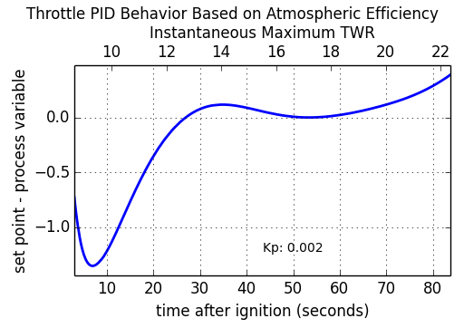
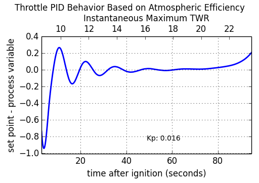
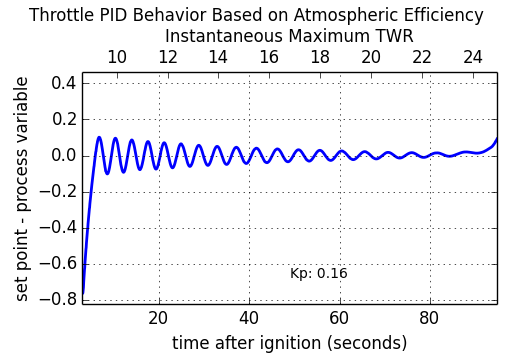

## PID Loops in kOS

This tutorial covers how one can implement a [PID loop](http://en.wikipedia.org/wiki/PID_controller) using kOS. A P-loop, or "proportional feedback loop" was already introduced in the second section of the [Design Patterns Tutorial](summary_topics/intermediate_tutorial/index.html), and that will serve as our starting point. After some code rearrangement, the integral and derivative terms will be added and discussed in turn. Next, a couple extra features will be added to the full PID-loop. Lastly, we'll show a case-study in tuning a full PID loop using the Ziegler-Nichols method. We'll use the LOG method to dump telemetry from KSP into a file and our favorite graphing software to visualize the data.

The code examples in this tutorial can be tested with a similar rocket design as shown. Do not forget the accelerometer, gravioli detector or the kOS CPU module. The engine is purposefully overpowered to demonstrate the feedback in action.

### Proportional Feedback Loop (P-loop)

The example code from the [Design Patterns Tutorial](summary_topics/intermediate_tutorial/index.html), with some slight modifications looks like the following:

    // staging, throttle, steering, go
    WHEN STAGE:LIQUIDFUEL < 0.1 THEN {
        STAGE.
        PRESERVE.
    }
    LOCK THROTTLE TO 1.
    LOCK STEERING TO R(0,0,-90) + HEADING(90,90).
    STAGE.
    WAIT UNTIL SHIP:ALTITUDE > 1000.
    
    // P-loop setup
    SET g TO KERBIN:MU / KERBIN:RADIUS^2.
    LOCK accvec TO SHIP:SENSORS:ACC - SHIP:SENSORS:GRAV.
    LOCK gforce TO accvec:MAG / g.
    LOCK dthrott TO 0.05 * (1.2 - gforce).
    
    SET thrott TO 1.
    LOCK THROTTLE to thrott.
    
    UNTIL SHIP:ALTITUDE > 40000 {
        SET thrott to thrott + dthrott.
        WAIT 0.1.
    }

The first several lines sets up a simple staging condition, puts the throttle to maximum, steers the rocket straight up and launches. The rocket is assumed to use only liquid fuel engines. After the rocket hits 1km, the script sets up the LOCK used in the P-loop which is updated every 0.1 seconds in the UNTIL loop. The use of LOCK variables makes this code fairly clean. When the script comes up to the first line in the UNTIL loop, i.e. "SET thrott TO thrott + dthrott.", the variable dthrott is evaluated which causes the LOCK on gforce to be evaluated which in-turn causes accvec to be evaluated.

The input to this feedback loop is the acceleration experienced by the ship (gforce) in terms of Kerbin's gravitational acceleration at sea level (g). The variable accvec is the total acceleration vector and is obtained by the accelerometer and gravioli detectors, both of which must be on the ship for this to work. The variable dthrott is the change in throttle that should be applied in a single iteration of the feedback loop.

In terms of a PID loop, the factor 1.2 is called the setpoint, gforce is the process variable and 0.05 is called the proportional gain. The setpoint and gain factors can be promoted to their own variables with names. Also, the code up to and including the "WAIT UNTIL SHIP:ALTITUDE > 1000." will be implied for the next few examples of code:

    // P-loop
    SET g TO KERBIN:MU / KERBIN:RADIUS^2.
    LOCK accvec TO SHIP:SENSORS:ACC - SHIP:SENSORS:GRAV.
    LOCK gforce TO accvec:MAG / g.
    
    SET gforce_setpoint TO 1.2
    SET Kp TO 0.05.
    LOCK dthrott TO Kp * (gforce_setpoint - gforce).
    
    SET thrott TO 1.
    LOCK THROTTLE to thrott.
    
    UNTIL SHIP:ALTITUDE > 40000 {
        SET thrott to thrott + dthrott.
        WAIT 0.1.
    }

This is not a big change, but it will set us up to include the integral and derivative terms in the next section.

### Proportional-Integral Feedback Loop (PI-loop)

Adding the integral term requires us to keep track of time. This is done by introducing a variable (t0) to store the time of the last iteration. Now, the throttle is changed only on iterations where some time has elapsed so the WAIT time in the UNTIL can be brought to 0.001. The offset of the gforce has been set to the variable P, and the integral gain to Ki. 

    // PI-loop
    SET g TO KERBIN:MU / KERBIN:RADIUS^2.
    LOCK accvec TO SHIP:SENSORS:ACC - SHIP:SENSORS:GRAV.
    LOCK gforce TO accvec:MAG / g.
    
    SET gforce_setpoint TO 1.2
    
    LOCK P TO gforce_setpoint - gforce.
    SET I TO 0.
    
    SET Kp TO 0.05.
    SET Ki TO 0.05.
    
    LOCK dthrott TO Kp * P + Ki * I.
    
    SET thrott TO 1.
    LOCK THROTTLE to thrott.

    SET t0 TO TIME:SECONDS.
    UNTIL SHIP:ALTITUDE > 40000 {
        SET dt TO TIME:SECONDS - t0.
        IF dt > 0 {
            SET I TO I + P * dt.
            SET thrott to thrott + dthrott.
            SET t0 TO TIME:SECONDS.
        }
        WAIT 0.001.
    }

Adding the integral term has the general effect of stabilizing the feedback loop, making it less prone to oscillating due to rapid changes in the process variable (gforce, in this case). This is usually at the expense of a longer settling time.

### Proportional-Integral-Derivative Feedback Loop (PID-loop)

Incorporating the derivative term (D) and derivative gain (Kd) requires an additional variable (P0) to keep track of the previous value of the proportional term (P). 

    // PID-loop
    SET g TO KERBIN:MU / KERBIN:RADIUS^2.
    LOCK accvec TO SHIP:SENSORS:ACC - SHIP:SENSORS:GRAV.
    LOCK gforce TO accvec:MAG / g.
    
    SET gforce_setpoint TO 1.2
    
    LOCK P TO gforce_setpoint - gforce.
    SET I TO 0.
    SET D TO 0.
    SET P0 TO P.
    
    SET Kp TO 0.05.
    SET Ki TO 0.05.
    SET Kd TO 0.05.
    
    LOCK dthrott TO Kp * P + Ki * I + Kd * D.
    
    SET thrott TO 1.
    LOCK THROTTLE to thrott.

    SET t0 TO TIME:SECONDS.
    UNTIL SHIP:ALTITUDE > 40000 {
        SET dt TO TIME:SECONDS - t0.
        IF dt > 0 {
            SET I TO I + P * dt.
            SET D TO (P - P0) / dt.
            SET thrott to thrott + dthrott.
            SET P0 TO P.
            SET t0 TO TIME:SECONDS.
        }
        WAIT 0.001.
    }

When tuned properly, the derivative term will cause the PID-loop to act quickly without causing problematic oscillations. Later in this tutorial, we will cover a way to tune a PID-loop using only the proportional term called the Zieger-Nichols method.

### Final Touches

There are a few modifications that can make PID loops very robust. The following code example adds three range limits:

1. bounds on the Integral term which addresses possible [integral windup](http://en.wikipedia.org/wiki/Integral_windup)
2. bounds on the throttle since it must stay in the range 0 to 1
3. a [deadband](http://en.wikipedia.org/wiki/Deadband) to avoid changing the throttle due to small fluctuations

Of course, KSP is a simulator and small fluctuations are not observed in this particular loop. Indeed, the P-loop is sufficient in this example, but all these features are included here for illustration purposes and they could become useful for unstable aircraft or untested scenarios.

    // PID-loop
    SET g TO KERBIN:MU / KERBIN:RADIUS^2.
    LOCK accvec TO SHIP:SENSORS:ACC - SHIP:SENSORS:GRAV.
    LOCK gforce TO accvec:MAG / g.
    
    SET gforce_setpoint TO 1.2
    
    LOCK P TO gforce_setpoint - gforce.
    SET I TO 0.
    SET D TO 0.
    SET P0 TO P.
    
    LOCK in_deadband TO ABS(P) < 0.01.
    
    SET Kp TO 0.05.
    SET Ki TO 0.05.
    SET Kd TO 0.05.
    
    LOCK dthrott TO Kp * P + Ki * I + Kd * D.
    
    SET thrott TO 1.
    LOCK THROTTLE to thrott.
    
    SET t0 TO TIME:SECONDS.
    UNTIL SHIP:ALTITUDE > 40000 {
        SET dt TO TIME:SECONDS - t0.
        IF dt > 0 {
            IF NOT in_deadband {
                SET I TO I + P * dt.
                SET D TO (P - P0) / dt.
                
                // If Ki is non-zero, then limit Ki*I to [-1,1]
                IF Ki > 0 {
                    SET I TO MIN(1.0/Ki, MAX(-1.0/Ki, I)).
                }
                
                // set throttle but keep in range [0,1]
                SET thrott to MIN(1, MAX(0, thrott + dthrott)).
                
                SET P0 TO P.
                SET t0 TO TIME:SECONDS.
            }
        }
        WAIT 0.001.
    }

### Tuning a PID-loop

We are going to start with the same rocket design we have been using so far and actually tune the PID-loop using the Ziegler-Nichols method. This is where we turn off the integral and derivative terms in the loop and bring the proportional gain (Kp) up from zero to the point where the loop causes a steady oscillation with a measured period (Tu). At this point, the proportional gain is called the "ultimate gain" (Ku) and the actual gains (Kp, Ki and Kd) are set according to this table [taken from wikipedia](http://en.wikipedia.org/wiki/Ziegler%E2%80%93Nichols_method):

Control Type | Kp | Ki | Kd
--- | --- | --- | ---
P | 0.5 Ku | - | -
PI | 0.45 Ku | 1.2 Kp / Tu | -
PD | 0.8 Ku | - | Kp Tu / 8
classic PID | 0.6 Ku | 2 Kp / Tu | Kp Tu / 8
Pessen Integral Rule | 0.7 Ku | 0.4 Kp / Tu | 0.15 Kp Tu
some overshoot | 0.33 Ku | 2 Kp / Tu | Kp Tu / 3
no overshoot | 0.2 Ku | 2 Kp / Tu | Kp Tu / 3

An immediate problem to overcome with this method is that it assumes a steady state can be achieved. With rockets, there is never a steady state: fuel is being consumed, altitude and therefore gravity and atmosphere is changing, staging can cause major upsets in the feedback loop. So, this tuning method will be some approximation which should come as no surprise since it will come from experimental observation. All we need is enough of a steady state that we can measure the oscillations - both the change in amplitude and the period.

The script we'll use to tune the highly overpowered rocket shown will launch the rocket straight up (using SAS) and will log data to an output file until it reaches 30km at which point the log file will be copied to the archive and the program will terminate. Also, this time the feedback loop will be based on the more realistic "atmospheric efficiency." The log file will contain three columns: time since launch, offset of atmospheric efficiency from the ideal (in this case, 1.0) and the ship's maximum thrust. The maximum thrust will increase monotonically with time (this rocket has only one stage) and we'll use both as the x-axis when plotting the offset on the y-axis.

    DECLARE PARAMETER Kp.
    
    LOCK g TO SHIP:BODY:MU / (SHIP:BODY:RADIUS + SHIP:ALTITUDE)^2.
    LOCK maxtwr TO SHIP:MAXTHRUST / (g * SHIP:MASS).
    
    // feedback based on atmospheric efficiency
    LOCK surfspeed TO SHIP:VELOCITY:SURFACE:MAG.
    LOCK atmoeff TO surfspeed / SHIP:TERMVELOCITY.
    LOCK P TO 1.0 - atmoeff.
    
    SET t0 TO TIME:SECONDS.
    LOCK dthrott TO Kp*P.
    SET start_time TO t0.
    
    LOG "# Throttle PID Tuning" TO throttle_log.
    LOG "# Kp: " + Kp TO throttle_log.
    LOG "# t P maxtwr" TO throttle_log.
    
    LOCK logline TO (TIME:SECONDS - start_time)
            + " " + P
            + " " + maxtwr.
    
    SET thrott TO 1.
    LOCK THROTTLE TO thrott.
    SAS ON.
    STAGE.
    WAIT 3.
    
    UNTIL SHIP:ALTITUDE > 30000 {
        SET dt TO TIME:SECONDS - t0.
        IF dt > 0 {
            SET thrott TO MIN(1,MAX(0,thrott + dthrott)).
            SET t0 TO TIME:SECONDS.
            LOG logline TO throttle_log.
        }
        WAIT 0.001.
    }
    COPY throttle_log TO 0.

Give this script a short name, something like "tune.txt" so that running is simple:

    copy tune from 0.
    run tune(0.5).

After every launch completes, you'll have to go into the archive directory and rename the output logfile. Something like "throttle_log.txt" --> "throttle.01.log" will help if you increment the index number each time. To analyze the data, plot the offset (P) as a function of time (t). Since the maximum TWR is a function of time, you can include that as well as a secondary x-axis. Here, we show the results for three values of Kp: 0.002, 0.016 and 0.160:

